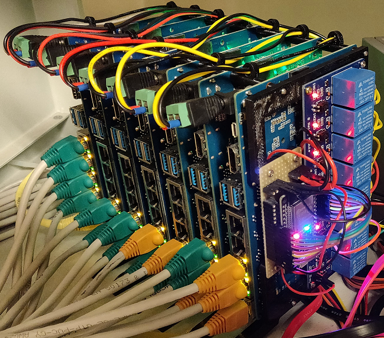
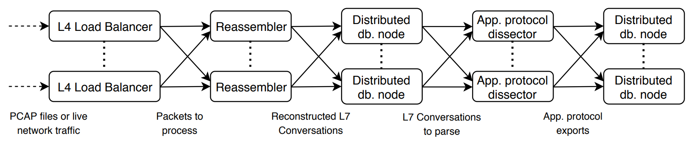
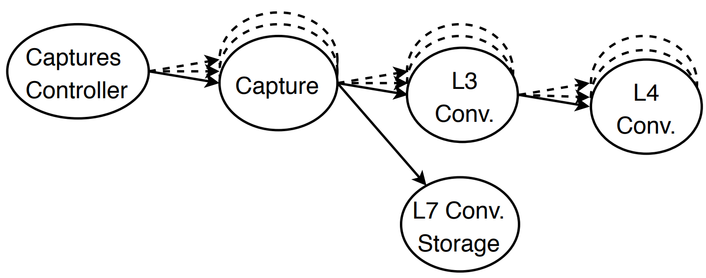
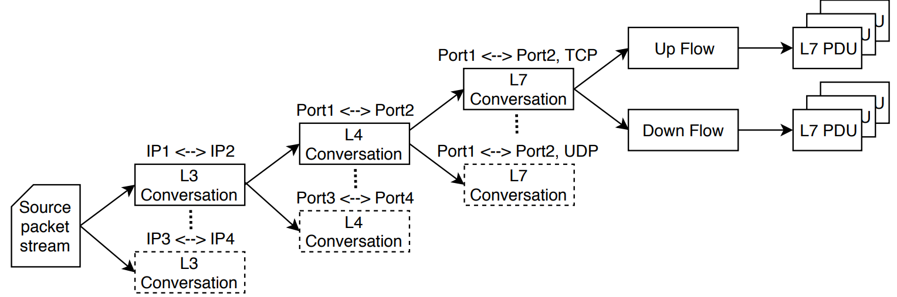

# NTPAC: Network Traffic Processing & Analysis Cluster
NTPAC is a distributed network forensics tool. 
It is capable of distributing the input network traffic capture (originating from a live network interface or from a PCAP/ng file) among workers in a cluster, which reassemble existing L7 conversations and dissect them using application protocol parsers.


## Deployment of Docker containers
```
1. Join nodes into a Docker Swarm cluster
2. Establish roles of individual nodes in a cluster (single node can have multiple roles):
	Single distributed system seed node: $ docker node update --label-add lighthouse=true NODE
	Reassemblers (worker nodes): $ docker node update --label-add reassembler=true NODE
	Cassandra nodes: $ docker node update --label-add cassandara=true NODE
3. Configure required number of Reassembler and Cassadra nodes by specifiying the number of replicas of reassembler and cassandra services in NTPAC/docker-compose-cassandra.yml.
4. Deploy ntpac stack: $ docker stack deploy -c NTPAC/docker-compose-cassandra.yml --with-registry-auth ntpac
5. Initialize Cassandra database: $ docker run --network ntpac_default docker.nesad.fit.vutbr.cz/cassandrainitializer:latest
6. Run LoadBalancer node with substitued HOST_PCAP_DIRECTORY and PCAP_FILE variables: $ docker run --network ntpac_default --mount type=bind,source=HOST_PCAP_DIRECTORY,target=/pcap docker.nesad.fit.vutbr.cz/loadbalancer:latest -env NTPAC_SEED_NODE=lighthouse docker.nesad.fit.vutbr.cz/loadbalancer:latest /pcap/PCAP_FILE
```

## BPI-R2 Cluster
Banana Pi cluster prototype is a hardware implementation of a cluster built from seven Banana Pi BPI-R2 router boards. The cluster is designed for a demonstration and testing purposes of currently developed distributed applications at the NES@FIT research group.

To allow remote power management of individual Banana Pi boards, the board power supplies are connected through a relay board. Individual relays are controlled by an integrated microcontroller ESP32, which can be accessed via an embedded web application. After login to this application, the user can control the state of each relay and thus control the power supply state of an individual Banana Pi board. To gain an IP connectivity, the microcontroller is configured to connect to one of multiple preconfigured, available WLAN networks. 

Performance characteristics:
* 7 BananaPi R2 router boardů:
  * MediaTek MT7623N, Quad-core ARM Cortex-A7
  * Mali 450 MP4 GPU
  * 2G DDR3 SDRAM
  * 1x Mini PCIE interface
  * 2x SATA interface
  * 2x Gigabit ethernet interface
  * Ubuntu 16.04



## Architecture
The architecture consists of multiple modules that form theprocessing pipeline. At the highest level, theNTPACworkflow can be divided into two main phases:



**Data pre-processing** reconstructs application layer con-versations (L7 conversation) Each of these conversa-tions is made up of source and destination endpoints,timestamps, and other information that is needed forsubsequent processing.




**Data analysis** identifies application protocols in recon-structed conversations and uses an appropriate ap-plication protocol decoder to reconstruct applicationevents from given conversations, such as visited webpages, sent emails, queried domains, etc. The outputof this phase is a set of forensic artifacts.

These phases correspond to low-level analysis and high-level analysis. The separation of data pre-processing from thedata analysis enables to use the actor-based computationalmodel and offer the ability to distribute the computation.

## Performance
We  focused  our  preliminary  assessment  on  determiningthe  performance  parameters  of  the  created  tool.  Duringthe experiments, we considered both the data storage sce-nario in the distributed database and the case where dataanalysis uses the output from the previous step directly.The goal is to demonstrate the scalability of the proposed so-lution and show the available throughput in various possibleconfigurations. We have considered two major test scenarios:

**Standalone processing** tests how fast is captured trafficprocessed on a single machine inside one process. Thistest-case shows total throughput of our processingalgorithms (especially reassembling and applicationprotocol  parsing)  on  given  machine  type.  Becausethe whole processing is running under oneCommonLanguage Runtime(CLR), it is expected to be fasterthan distributed processing with a low number of pro-cessing nodes. This experiment provides a baselineto which other results are compared.

**Cluster Processing** shows the scalability of our solutionin a computing cluster. We tested it in a distributed en-vironment with a different number of nodes. The testscenarios considered (i) processing with a singleLoadBalancerand different numbers ofReassemblernodesand (ii) a different number ofLoad BalancerandRe-assemblernodes.For our test purposes, we have chosen multiple differentcomputing environments described in Table 1. The E.1 envi-ronment consists of 14 workstations that are all connectedto the same local network. Environment E.2 is a cluster-integrated Google Cloud Platform consisting of 12 virtualmachines. E.3 is a mini-cluster of four server boards in a sin-gle chassis. Finally, E.4 is a single powerful workstation.

Testing environments used for performance evaluation. 
|                                               | E.1      | E.2             | E.3        | E.4        |
|-----------------------------------------------|-----------------------|------------------------------|-------------------------|-------------------------|
| Machine Type                      | Desktop computers     | Google Cloud Platform * | Mini-cluster | Workstation             |
| Machines count                    | 14                    | 12                           | 4                       | 1                       |
| CPU Type                          | Intel i5-3570K       | Intel Xeon E5                | Intel Xeon E5520        | Intel i7-5930K         |
| Physical Cores                    | 4                     | 2                            | 4                       | 6                       |
| Logical Cores                     | 4                     | 4                            | 8                       | 12                      |
| CPU Frequency                     | 3.40GHz  | 2.60GHz         | 2.26GHz    | 3.50GHz    |
| CPU Frequency Turbo --- 1 core | 3.80GHz  | 2.80GHz         | 3.53GHz    | 4.30GHz    |
| RAM                               | 8GB       | 7GB              | 48GB        | 64GB        |
| Sequential disk read/write        | 73/67MB/s | 120/118MB/s      | 282/265MB/s | 490/430MB/s |
| Network Card                      | 1Gbps     | 10Gbps           | 1Gbps       | 1Gbps       |
| * n1-highcpu-4                         |                       |                              |                         |                         |

Processing speeds of individual network capture processing phases in standalone test scenario performed on test environments E.4 and E.3.
|                                           | Workstation E.4   \[Mbps\] | Server E.3 \[Mbps\] |
|-------------------------------------------|-------------------------------------------------|------------------------------------------|
| PCAP file reading             | 5103                                            | 5719                                     |
| Packet parsing                | 3853                                            | 1679                                     |
| L7 Conversation reassembling  | 942                                             | 380                                      |
| Application protocols parsing | 880                                             | 358                                      |

Processing speeds of commonly used network forensic tools measured on test environment Workstation E.4.
|                          | ntpac | Netfox | Wireshark | NetworkMiner |
|--------------------------|---------------------|--------------------|-----------------------|--------------------------|
|                          | \[Mbps\]    | \[Mbps\]   | \[Mbps\]      | \[Mbps\]         |
| M57 Analysis | 880                 | 65.6              | 73.4                 | 15.8                    |

|                          | ntpac | Netfox | Wireshark | NetworkMiner |
|--------------------------|---------------------|--------------------|-----------------------|--------------------------|
|                          | \[Mbps\]    | \[Mbps\]   | \[Mbps\]      | \[Mbps\]         |
| M57 Analysis | 880                 | 65.6              | 73.4                 | 15.8                    |

Performance measurements of clustered processing conducted in test environment E.1.
| Reassemblers | S \[Mbps\] | 1 \[Mbps\] | 2 \[Mbps\] | 4 \[Mbps\] | 6 \[Mbps\] | 8 \[Mbps\] | 10 \[Mbps\] |
|--------------------------|------------------------|------------------------|------------------------|------------------------|------------------------|------------------------|-------------------------|
| 1            | 513                    | 380                    | 670                    | 768                    | 778                    | 797                    | 815                     |
| 2            |                        | 310                    | 574                    | 1093                   | 1370                   | 1508                   | 1542                    |
| 3            |                        | 290                    | 602                    | 1136                   | 1713                   | 1945                   | 2070                    |
| 4            |                        | 269                    | 660                    | 1258                   | 1971                   | 2252                   | 2580                    |
| 1            | 343                    | 273                    | 478                    | 729                    | 734                    | 740                    | 742                     |
| 2            |                        | 247                    | 482                    | 801                    | 1009                   | 1123                   | 1254                    |
| 3            |                        | \*                     | 501                    | 930                    | 1131                   | 1326                   | 1438                    |
| 4            |                        | \*                     | 503                    | 949                    | 1135                   | 1375                   | 1710                    |

Performance measurements ofclusteredprocessingconducted in test environment E.2.
| Reassemblers | S \[Mbps\] | 1 \[Mbps\] | 2 \[Mbps\] | 4 \[Mbps\] | 6 \[Mbps\] | 8 \[Mbps\] |
|--------------------------|------------------------|------------------------|------------------------|------------------------|------------------------|------------------------|
| 1            | 427                    | 223                    | 370                    | 560                    | 573                    | 585                    |
| 2            |                        | 170                    | 334                    | 706                    | 916                    | 994                    |
| 3            |                        | 126                    | 352                    | 734                    | 826                    | 1016                   |
| 4            |                        | 104                    | 271                    | 580                    | 618                    | 920                    |
| 1            | 248                    | 171                    | 255                    | 459                    | 497                    | 498                    |
| 2            |                        | \*                     | 219                    | 420                    | 459                    | 675                    |
| 3            |                        | \*                     | \*                     | 383                    | 452                    | 558                    |
| 4            |                        | \*                     | \*                     | \*                     | \*                     | \*                     |


Performance measurements of clustered processing conducted in test environment E.3.
| Reassemblers                 | S \[Mbps\] | 1 \[Mbps\] | 2 \[Mbps\] | 3 \[Mbps\] |
|------------------------------------------|------------------------|------------------------|------------------------|------------------------|
| 1 --- Without Persistence | 358                    | 233                    | 407                    | 453                    |
| 1 --- With Persistence    | 210                    | 158                    | 301                    | 388                    |


## Publications
The NTPAC, and underlying BPI-R2 cluster was used in these publications:
* [A Scalable Architecture for Network Traffic Forensics](https://www.fit.vut.cz/research/publication/11927/.en)
* [Network Forensic Analysis for Lawful Enforcementon Steroids, Distributed and Scalable](https://www.fit.vut.cz/research/publication/11991/.en)